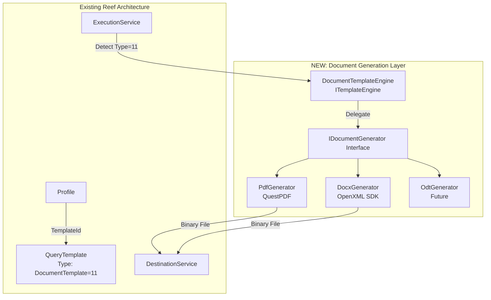
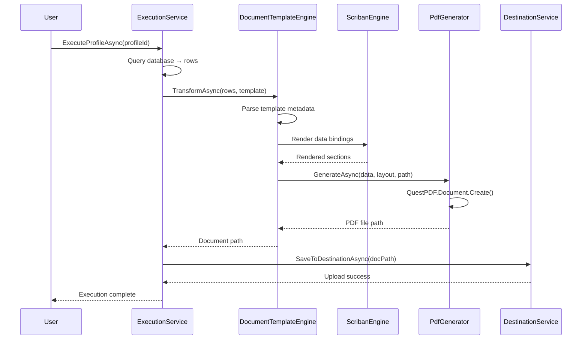

# Document Generation Feature - Design Specification

**Version:** 1.0  
**Date:** December 17, 2025  
**Status:** Approved for Implementation  
**Approach:** Option B - Hybrid (Scriban + QuestPDF)

---

## Executive Summary

This document specifies the design for extending Reef's destination services with document generation capabilities (PDF, DOCX, ODT). The solution uses a **hybrid approach** combining Scriban templates for data binding with document-specific layout languages.

### Key Design Decisions

1. **Template Type Extension**: Add `DocumentTemplate = 11` to `QueryTemplateType` enum
2. **Library Selection**: QuestPDF (Community License) for PDF generation
3. **Architecture Pattern**: New `IDocumentGenerator` interface with format-specific implementations
4. **Integration Point**: ExecutionService detects DocumentTemplate type and routes to document generation pipeline
5. **Recursion Strategy**: Leverage Scriban's existing loop capabilities for multi-page/multi-section documents

---

## 1. Business Requirements

### 1.1 Primary Use Cases

**Confirmed by User:**
- **Invoicing**: Generate multi-page PDF invoices with page numbering (Page X of N)
- **Picklists**: Create paginated warehouse picking lists
- **Mail Merge**: Produce document-per-record outputs (letters, certificates, reports)
- **Annual Gross Revenue**: < $1M USD (QuestPDF Community License compliant)

### 1.2 Functional Requirements

| ID | Requirement | Priority |
|----|-------------|----------|
| FR-1 | Generate PDF documents from query data | **CRITICAL** |
| FR-2 | Support DOCX output format | High |
| FR-3 | Support ODT output format | Medium |
| FR-4 | Enable multi-page document generation with page numbering | **CRITICAL** |
| FR-5 | Support recursive structures (e.g., invoice line items across pages) | High |
| FR-6 | Integrate with existing Profile/Template/Destination architecture | **CRITICAL** |
| FR-7 | Maintain compatibility with existing split functionality (one document per SplitKeyColumn value) | High |
| FR-8 | Preserve Scriban template syntax for data binding | High |
| FR-9 | Support standard page sizes (A4, Letter, Legal) and orientations | Medium |
| FR-10 | Handle images and logos in documents | Medium |

### 1.3 Non-Functional Requirements

| ID | Requirement | Target |
|----|-------------|---------|
| NFR-1 | Memory efficiency for large documents | < 500MB for 1000-page PDF |
| NFR-2 | Generation performance | < 5 seconds for 50-page invoice |
| NFR-3 | Template validation response time | < 1 second |
| NFR-4 | Backward compatibility | 100% existing templates unaffected |
| NFR-5 | License compliance | QuestPDF Community License terms |

---

## 2. Technical Architecture

### 2.1 System Context Diagram



### 2.2 Component Responsibilities

#### 2.2.1 DocumentTemplateEngine (ITemplateEngine)

**Location:** `/Source/Reef/Core/TemplateEngines/DocumentTemplateEngine.cs`

**Responsibility:** Parse hybrid Scriban + document layout template, delegate to format-specific generator

```csharp
/// <summary>
/// Template engine for document generation (PDF, DOCX, ODT)
/// Combines Scriban data binding with document layout DSL
/// </summary>
public class DocumentTemplateEngine : ITemplateEngine
{
    private readonly ScribanTemplateEngine _scribanEngine;
    private readonly IDocumentGeneratorFactory _generatorFactory;
    
    public string EngineName => "Document";
    
    // Parses template structure, extracts Scriban sections, invokes generator
    public async Task<string> TransformAsync(
        List<Dictionary<string, object>> data,
        string template,
        Dictionary<string, object>? context = null)
    {
        // Returns base64-encoded document or path to temp file
    }
    
    public (bool IsValid, string? ErrorMessage) ValidateTemplate(string template)
    {
        // Validates both Scriban syntax AND document layout syntax
    }
}
```

**Key Behaviors:**
1. Detects output format from template metadata: `{{! format: pdf }}` or `{{! format: docx }}`
2. Parses Scriban sections (data binding expressions)
3. Delegates to `IDocumentGenerator` implementation
4. Returns **file path to generated document** (not string content like other engines)

#### 2.2.2 IDocumentGenerator Interface

**Location:** `/Source/Reef/Core/DocumentGeneration/IDocumentGenerator.cs`

```csharp
namespace Reef.Core.DocumentGeneration;

/// <summary>
/// Interface for document format generators (PDF, DOCX, ODT)
/// </summary>
public interface IDocumentGenerator
{
    /// <summary>
    /// Supported output format (PDF, DOCX, ODT)
    /// </summary>
    string OutputFormat { get; }
    
    /// <summary>
    /// Generate document from data and layout definition
    /// </summary>
    /// <param name="data">Query results</param>
    /// <param name="layoutDefinition">Document layout DSL</param>
    /// <param name="outputPath">Path to write generated document</param>
    /// <param name="options">Generation options (page size, margins, etc.)</param>
    /// <returns>Success status and file size</returns>
    Task<(bool Success, long FileSizeBytes, string? ErrorMessage)> GenerateAsync(
        List<Dictionary<string, object>> data,
        DocumentLayout layoutDefinition,
        string outputPath,
        DocumentOptions? options = null);
    
    /// <summary>
    /// Validate layout definition syntax
    /// </summary>
    (bool IsValid, string? ErrorMessage) ValidateLayout(string layoutDefinition);
}

/// <summary>
/// Document layout configuration (page setup, sections, content blocks)
/// </summary>
public class DocumentLayout
{
    public PageSetup PageSetup { get; set; } = new();
    public List<DocumentSection> Sections { get; set; } = new();
}

public class PageSetup
{
    public string Size { get; set; } = "A4"; // A4, Letter, Legal
    public string Orientation { get; set; } = "Portrait"; // Portrait, Landscape
    public Margins Margins { get; set; } = new();
}

public class Margins
{
    public float Top { get; set; } = 25;    // mm
    public float Bottom { get; set; } = 25;
    public float Left { get; set; } = 25;
    public float Right { get; set; } = 25;
}

public class DocumentSection
{
    public string Type { get; set; } = "Content"; // Header, Content, Footer
    public string ScribanTemplate { get; set; } = string.Empty; // Embedded Scriban
    public Dictionary<string, object> Properties { get; set; } = new();
}

public class DocumentOptions
{
    public bool IncludePageNumbers { get; set; } = true;
    public string PageNumberFormat { get; set; } = "Page {page} of {total}";
    public string? Watermark { get; set; }
    public bool CompressPdf { get; set; } = true;
}
```

#### 2.2.3 PdfGenerator (QuestPDF Implementation)

**Location:** `/Source/Reef/Core/DocumentGeneration/PdfGenerator.cs`

**Dependencies:** `QuestPDF` NuGet package (Community License)

```csharp
/// <summary>
/// PDF document generator using QuestPDF Fluent API
/// </summary>
public class PdfGenerator : IDocumentGenerator
{
    public string OutputFormat => "PDF";
    
    public async Task<(bool Success, long FileSizeBytes, string? ErrorMessage)> GenerateAsync(
        List<Dictionary<string, object>> data,
        DocumentLayout layoutDefinition,
        string outputPath,
        DocumentOptions? options = null)
    {
        try
        {
            // QuestPDF Community License configuration
            QuestPDF.Settings.License = LicenseType.Community;
            
            Document.Create(container =>
            {
                container.Page(page =>
                {
                    // Apply page setup from layoutDefinition
                    ApplyPageSetup(page, layoutDefinition.PageSetup);
                    
                    // Render sections (header, content, footer)
                    foreach (var section in layoutDefinition.Sections)
                    {
                        RenderSection(page, section, data);
                    }
                    
                    // Add page numbers if enabled
                    if (options?.IncludePageNumbers == true)
                    {
                        page.Footer().AlignCenter().Text(text =>
                        {
                            text.CurrentPageNumber();
                            text.Span(" of ");
                            text.TotalPages();
                        });
                    }
                });
            })
            .GeneratePdf(outputPath);
            
            var fileSize = new FileInfo(outputPath).Length;
            return (true, fileSize, null);
        }
        catch (Exception ex)
        {
            Log.Error(ex, "PDF generation failed");
            return (false, 0, ex.Message);
        }
    }
    
    private void ApplyPageSetup(PageDescriptor page, PageSetup setup)
    {
        // Convert page size string to QuestPDF PageSize
        page.Size(setup.Size switch
        {
            "A4" => PageSizes.A4,
            "Letter" => PageSizes.Letter,
            "Legal" => PageSizes.Legal,
            _ => PageSizes.A4
        });
        
        page.MarginTop(setup.Margins.Top, Unit.Millimetre);
        page.MarginBottom(setup.Margins.Bottom, Unit.Millimetre);
        page.MarginLeft(setup.Margins.Left, Unit.Millimetre);
        page.MarginRight(setup.Margins.Right, Unit.Millimetre);
        
        if (setup.Orientation == "Landscape")
            page.PageColor(Colors.White);
    }
    
    private void RenderSection(PageDescriptor page, DocumentSection section, List<Dictionary<string, object>> data)
    {
        // Render Scriban template for section content
        // Convert to QuestPDF layout elements (Text, Table, Image, etc.)
    }
}
```

**QuestPDF License Compliance:**
- Set `QuestPDF.Settings.License = LicenseType.Community` at startup
- Valid for businesses with < $1M USD annual gross revenue (user confirmed)
- Document in README.md and code comments

#### 2.2.4 DocxGenerator (OpenXML SDK Implementation)

**Location:** `/Source/Reef/Core/DocumentGeneration/DocxGenerator.cs`

**Dependencies:** `DocumentFormat.OpenXml` NuGet package (MIT License)

```csharp
/// <summary>
/// DOCX document generator using Open XML SDK
/// </summary>
public class DocxGenerator : IDocumentGenerator
{
    public string OutputFormat => "DOCX";
    
    public async Task<(bool Success, long FileSizeBytes, string? ErrorMessage)> GenerateAsync(
        List<Dictionary<string, object>> data,
        DocumentLayout layoutDefinition,
        string outputPath,
        DocumentOptions? options = null)
    {
        try
        {
            using (WordprocessingDocument wordDoc = WordprocessingDocument.Create(outputPath, WordprocessingDocumentType.Document))
            {
                // Create main document part
                MainDocumentPart mainPart = wordDoc.AddMainDocumentPart();
                mainPart.Document = new Document();
                Body body = mainPart.Document.AppendChild(new Body());
                
                // Render sections as Word paragraphs/tables
                foreach (var section in layoutDefinition.Sections)
                {
                    RenderSectionAsWordContent(body, section, data);
                }
                
                mainPart.Document.Save();
            }
            
            var fileSize = new FileInfo(outputPath).Length;
            return (true, fileSize, null);
        }
        catch (Exception ex)
        {
            Log.Error(ex, "DOCX generation failed");
            return (false, 0, ex.Message);
        }
    }
    
    private void RenderSectionAsWordContent(Body body, DocumentSection section, List<Dictionary<string, object>> data)
    {
        // Convert Scriban-rendered content to OpenXML elements
        // Add paragraphs, tables, runs, etc.
    }
}
```

#### 2.2.5 IDocumentGeneratorFactory

**Location:** `/Source/Reef/Core/DocumentGeneration/IDocumentGeneratorFactory.cs`

```csharp
/// <summary>
/// Factory for creating document generators based on output format
/// </summary>
public interface IDocumentGeneratorFactory
{
    IDocumentGenerator GetGenerator(string outputFormat);
}

public class DocumentGeneratorFactory : IDocumentGeneratorFactory
{
    private readonly IServiceProvider _serviceProvider;
    
    public DocumentGeneratorFactory(IServiceProvider serviceProvider)
    {
        _serviceProvider = serviceProvider;
    }
    
    public IDocumentGenerator GetGenerator(string outputFormat)
    {
        return outputFormat.ToUpperInvariant() switch
        {
            "PDF" => _serviceProvider.GetRequiredService<PdfGenerator>(),
            "DOCX" => _serviceProvider.GetRequiredService<DocxGenerator>(),
            "ODT" => throw new NotImplementedException("ODT generator not yet implemented"),
            _ => throw new ArgumentException($"Unsupported document format: {outputFormat}")
        };
    }
}
```

### 2.3 Data Flow

#### 2.3.1 Document Generation Pipeline



#### 2.3.2 Template Processing Steps

1. **Template Parsing**: DocumentTemplateEngine extracts metadata (`{{! format: pdf }}`)
2. **Scriban Data Binding**: Scriban renders data expressions (e.g., `{{ invoice.number }}`)
3. **Layout Application**: Generator applies page setup, margins, orientation
4. **Section Rendering**: Each section (header/content/footer) rendered with bound data
5. **Page Numbering**: Total page count calculated, page numbers inserted
6. **File Generation**: Binary document written to temp path
7. **Destination Upload**: Standard DestinationService uploads to configured target

---

## 3. Template Syntax Design

### 3.1 Hybrid Template Structure

Document templates combine **Scriban data binding** with **document layout directives**.

#### Example: Invoice PDF Template

```liquid
{{! format: pdf }}
{{! pageSize: A4 }}
{{! orientation: Portrait }}
{{! includePageNumbers: true }}

{{# header }}
<div style="text-align: center; font-weight: bold; font-size: 18pt;">
  {{ company.name }}
</div>
<div style="text-align: center; font-size: 10pt;">
  {{ company.address }} | {{ company.phone }}
</div>
<hr />
{{/ header }}

{{# content }}
<h2>Invoice {{ invoice.number }}</h2>
<p>Date: {{ invoice.date | date.to_string '%Y-%m-%d' }}</p>
<p>Customer: {{ customer.name }}</p>

<table>
  <thead>
    <tr>
      <th>Item</th>
      <th>Qty</th>
      <th>Price</th>
      <th>Total</th>
    </tr>
  </thead>
  <tbody>
    {{~ for line in invoice.lines ~}}
    <tr>
      <td>{{ line.description }}</td>
      <td>{{ line.quantity }}</td>
      <td>${{ line.unit_price | math.format '0.00' }}</td>
      <td>${{ line.total | math.format '0.00' }}</td>
    </tr>
    {{~ end ~}}
  </tbody>
</table>

<p style="font-weight: bold; text-align: right;">
  Total: ${{ invoice.total | math.format '0.00' }}
</p>
{{/ content }}

{{# footer }}
<div style="text-align: center; font-size: 8pt; color: gray;">
  {{ company.terms }}
</div>
{{/ footer }}
```

### 3.2 Template Directives

| Directive | Purpose | Example |
|-----------|---------|---------|
| `{{! format: pdf }}` | Output format (pdf, docx, odt) | `{{! format: pdf }}` |
| `{{! pageSize: A4 }}` | Page size | `{{! pageSize: Letter }}` |
| `{{! orientation: Portrait }}` | Page orientation | `{{! orientation: Landscape }}` |
| `{{! includePageNumbers: true }}` | Enable page numbers | `{{! includePageNumbers: false }}` |
| `{{# header }}` | Header section | Repeats on every page |
| `{{# content }}` | Main content section | Document body |
| `{{# footer }}` | Footer section | Repeats on every page |

### 3.3 Scriban Data Binding

All Scriban features available within sections:

- **Variables**: `{{ invoice.number }}`
- **Loops**: `{{~ for item in items ~}} ... {{~ end ~}}`
- **Conditionals**: `{{~ if total > 1000 ~}} ... {{~ end ~}}`
- **Filters**: `{{ date | date.to_string '%Y-%m-%d' }}`
- **Math**: `{{ price * quantity | math.format '0.00' }}`

---

## 4. Database Schema Changes

### 4.1 QueryTemplateType Enum Extension

**File:** `/Source/Reef/Core/Models/QueryTemplate.cs`

```csharp
public enum QueryTemplateType
{
    XmlTemplate = 1,      // Custom XML template (legacy)
    JsonTemplate = 2,     // Custom JSON template (legacy)
    XsltTransform = 3,    // XSLT transformation
    ForXmlRaw = 4,        // FOR XML RAW
    ForXmlAuto = 5,       // FOR XML AUTO
    ForXmlPath = 6,       // FOR XML PATH
    ForXmlExplicit = 7,   // FOR XML EXPLICIT
    ForJson = 8,          // FOR JSON AUTO
    ForJsonPath = 9,      // FOR JSON PATH
    ScribanTemplate = 10, // Scriban template engine
    DocumentTemplate = 11 // NEW: Document generation (PDF, DOCX, ODT)
}
```

**Migration:** None required (SQLite stores enum as integer, existing data unaffected)

### 4.2 OutputFormat Values

Extend `QueryTemplate.OutputFormat` allowed values:

- Existing: `XML`, `JSON`, `CSV`, `Text`, `YAML`, `HTML`, `EDI`
- **New**: `PDF`, `DOCX`, `ODT`

No schema change needed (OutputFormat is `string` field).

---

## 5. Frontend Integration

### 5.1 templates.html Updates

**File:** `/Source/Reef/Views/templates.html`

#### 5.1.1 Add DocumentTemplate Option to Dropdown

**Location:** Line ~205 (template type selector)

```html
<select id="template-type" class="form-select">
    <option value="">Select type...</option>
    <option value="ScribanTemplate">Scriban Template (CSV, XML, JSON, EDI, etc.)</option>
    
    <!-- NEW: Document Generation -->
    <option disabled style="color: #cbd5e0;">──────────</option>
    <option value="DocumentTemplate">Document Template (PDF, DOCX, ODT)</option>
    
    <!-- Built-in SQL Server Transforms -->
    <option disabled style="color: #cbd5e0;">──────────</option>
    <option value="XsltTransform">XSLT Transform</option>
    <!-- ... existing options ... -->
</select>
```

#### 5.1.2 Update TEMPLATE_FORMAT_CONFIG

**Location:** Line ~1185 (JavaScript configuration)

```javascript
const TEMPLATE_FORMAT_CONFIG = {
    'ScribanTemplate': {
        formats: ['CSV', 'JSON', 'XML', 'YAML', 'HTML', 'EDI', 'Text'],
        defaultFormat: 'CSV',
        description: 'Supports any output format'
    },
    // NEW: Document Template configuration
    'DocumentTemplate': {
        formats: ['PDF', 'DOCX', 'ODT'],
        defaultFormat: 'PDF',
        description: 'Generate documents with page layout'
    },
    'XsltTransform': {
        formats: ['XML'],
        defaultFormat: 'XML',
        description: 'XSLT always outputs XML'
    },
    // ... existing configurations ...
};
```

#### 5.1.3 Add Document-Specific Options UI

**Location:** After template editor section (~line 400)

```html
<!-- Document Generation Options (shown when type=DocumentTemplate) -->
<div id="document-options" style="display: none;">
    <div class="border-t border-gray-200 pt-4 mt-4">
        <h4 class="text-sm font-medium text-gray-700 mb-3">Document Options</h4>
        
        <div class="grid grid-cols-2 gap-4">
            <div>
                <label class="block text-sm font-medium text-gray-700 mb-1">Page Size</label>
                <select id="doc-page-size" class="form-select">
                    <option value="A4">A4 (210 × 297 mm)</option>
                    <option value="Letter">Letter (8.5 × 11 in)</option>
                    <option value="Legal">Legal (8.5 × 14 in)</option>
                </select>
            </div>
            
            <div>
                <label class="block text-sm font-medium text-gray-700 mb-1">Orientation</label>
                <select id="doc-orientation" class="form-select">
                    <option value="Portrait">Portrait</option>
                    <option value="Landscape">Landscape</option>
                </select>
            </div>
        </div>
        
        <div class="mt-3">
            <label class="flex items-center">
                <input type="checkbox" id="doc-page-numbers" checked class="form-checkbox">
                <span class="ml-2 text-sm text-gray-700">Include page numbers</span>
            </label>
        </div>
        
        <div class="mt-3">
            <label class="block text-sm font-medium text-gray-700 mb-1">Watermark (optional)</label>
            <input type="text" id="doc-watermark" class="form-input" placeholder="e.g., DRAFT, CONFIDENTIAL">
        </div>
    </div>
</div>

<script>
// Show/hide document options based on template type
document.getElementById('template-type').addEventListener('change', function(e) {
    const docOptions = document.getElementById('document-options');
    docOptions.style.display = (e.target.value === 'DocumentTemplate') ? 'block' : 'none';
});
</script>
```

### 5.2 Template Validation Endpoint

**File:** `/Source/Reef/Api/QueryTemplateEndpoints.cs`

Update validation endpoint to handle DocumentTemplate type:

```csharp
group.MapPost("/validate", (
    [FromBody] ValidateTemplateRequest request,
    [FromServices] IConfiguration configuration,
    [FromServices] DocumentTemplateEngine documentEngine) =>
{
    try
    {
        if (request.Type == QueryTemplateType.DocumentTemplate)
        {
            var (isValid, errorMessage) = documentEngine.ValidateTemplate(request.Template);
            return Results.Ok(new ValidateTemplateResponse
            {
                IsValid = isValid,
                ErrorMessage = errorMessage
            });
        }
        
        // Existing validation logic for other types...
    }
    catch (Exception ex)
    {
        return Results.Ok(new ValidateTemplateResponse
        {
            IsValid = false,
            ErrorMessage = ex.Message
        });
    }
})
```

---

## 6. ExecutionService Integration

### 6.1 Template Type Detection

**File:** `/Source/Reef/Core/Services/ExecutionService.cs`

**Location:** Around line 750 (template transformation logic)

```csharp
// Apply template transformation if specified
string? transformedContent = null;
string actualOutputFormat = profile.OutputFormat;

if (profile.TemplateId.HasValue)
{
    var template = await _templateService.GetByIdAsync(profile.TemplateId.Value);
    
    if (template != null)
    {
        // NEW: Handle DocumentTemplate type
        if (template.Type == QueryTemplateType.DocumentTemplate)
        {
            Log.Information("Applying document template '{TemplateName}' (PDF/DOCX/ODT)", template.Name);
            
            // DocumentTemplateEngine returns file path, not string content
            var documentPath = await _documentEngine.TransformAsync(rows, template.Template);
            
            // Move generated document to temp path expected by downstream code
            tempFilePath = documentPath; // Skip normal file writing
            fileSize = new FileInfo(tempFilePath).Length;
            finalPath = tempFilePath;
            actualOutputFormat = template.OutputFormat; // PDF, DOCX, or ODT
            
            Log.Debug("Document generation completed. File: {FilePath}, Size: {FileSize} bytes", 
                tempFilePath, fileSize);
        }
        else if (template.Type == QueryTemplateType.ScribanTemplate ||
                 template.Type == QueryTemplateType.XmlTemplate ||
                 template.Type == QueryTemplateType.JsonTemplate)
        {
            // Existing Scriban template handling
            Log.Information("Applying custom template '{TemplateName}' ({TemplateType})", 
                template.Name, template.Type);
            transformedContent = await _templateEngine.TransformAsync(rows, template.Template);
            actualOutputFormat = template.OutputFormat;
        }
        else
        {
            // Native SQL Server templates (FOR XML, FOR JSON)
            // ... existing logic ...
        }
    }
}
```

### 6.2 File Extension Mapping

**File:** `/Source/Reef/Core/Services/ExecutionService.cs`

Update `GetFileExtension` method:

```csharp
private string GetFileExtension(string format)
{
    return format.ToUpperInvariant() switch
    {
        "XML" => "xml",
        "JSON" => "json",
        "CSV" => "csv",
        "YAML" => "yaml",
        "HTML" => "html",
        "EDI" => "edi",
        "PDF" => "pdf",   // NEW
        "DOCX" => "docx", // NEW
        "ODT" => "odt",   // NEW
        _ => "txt"
    };
}
```

---

## 7. Dependency Injection Setup

### 7.1 Program.cs Configuration

**File:** `/Source/Reef/Program.cs`

Add document generation services to DI container:

```csharp
// Existing template engine
builder.Services.AddSingleton<ScribanTemplateEngine>();
builder.Services.AddSingleton<ITemplateEngine, PassthroughTemplateEngine>();

// NEW: Document generation services
builder.Services.AddSingleton<DocumentTemplateEngine>();
builder.Services.AddSingleton<PdfGenerator>();
builder.Services.AddSingleton<DocxGenerator>();
builder.Services.AddSingleton<IDocumentGeneratorFactory, DocumentGeneratorFactory>();

// QuestPDF Community License configuration
QuestPDF.Settings.License = LicenseType.Community;
```

---

## 8. NuGet Package Dependencies

### 8.1 Reef.csproj Updates

**File:** `/Source/Reef/Reef.csproj`

Add document generation packages:

```xml
<ItemGroup>
  <!-- Existing packages -->
  <PackageReference Include="Scriban" Version="6.5.0" />
  <PackageReference Include="Dapper" Version="2.1.66" />
  <!-- ... -->
  
  <!-- NEW: Document Generation Libraries -->
  <PackageReference Include="QuestPDF" Version="2024.12.0" />
  <PackageReference Include="DocumentFormat.OpenXml" Version="3.2.0" />
</ItemGroup>
```

### 8.2 Package Justification

| Package | Version | License | Purpose |
|---------|---------|---------|---------|
| QuestPDF | 2024.12.0 | Community (< $1M revenue) | PDF generation with Fluent API |
| DocumentFormat.OpenXml | 3.2.0 | MIT | DOCX generation (official Microsoft library) |

**Note:** ODT generation deferred to future phase (AODL library abandoned, needs research).

---

## 9. Recursion & Pagination Strategy

### 9.1 Multi-Page Document Handling

**Challenge:** Generate "Page X of N" requires knowing total page count before rendering.

**Solution:** QuestPDF calculates page count automatically during rendering. Use its built-in pagination:

```csharp
page.Footer().AlignCenter().Text(text =>
{
    text.Span("Page ");
    text.CurrentPageNumber(); // QuestPDF provides current page
    text.Span(" of ");
    text.TotalPages();        // QuestPDF calculates total pages
});
```

### 9.2 Invoice Line Item Recursion

**Scenario:** Invoice with 100 line items spanning 3 pages.

**Template Pattern:**

```liquid
{{# content }}
<h2>Invoice {{ invoice.number }}</h2>

<table>
  <thead>
    <tr><th>Item</th><th>Qty</th><th>Price</th></tr>
  </thead>
  <tbody>
    {{~ for line in invoice.lines ~}}
    <tr>
      <td>{{ line.description }}</td>
      <td>{{ line.quantity }}</td>
      <td>${{ line.unit_price }}</td>
    </tr>
    {{~ end ~}}
  </tbody>
</table>
{{/ content }}
```

**QuestPDF Rendering:** Automatically flows table rows across pages, repeating header on each page.

### 9.3 Multi-Document Output (Split Functionality)

**Existing Capability:** Profile.SplitKeyColumn generates one file per unique value.

**Document Generation Integration:**

```sql
-- Query returns multiple invoices
SELECT 
    invoice_id AS SplitKey, -- One PDF per invoice
    invoice_number,
    customer_name,
    JSON_QUERY(line_items) AS lines
FROM Invoices
```

**Profile Configuration:**
- `SplitEnabled`: true
- `SplitKeyColumn`: `SplitKey`
- `SplitFilenameTemplate`: `Invoice_{splitkey}_{date}.pdf`
- `TemplateId`: DocumentTemplate (PDF)

**Result:** ExecutionService.ProcessSingleSplitAsync generates:
- `Invoice_12345_20251217.pdf`
- `Invoice_12346_20251217.pdf`
- `Invoice_12347_20251217.pdf`

---

## 10. Testing Strategy

### 10.1 Unit Tests

**File:** `/Source/Reef.Tests/Core/DocumentGeneration/PdfGeneratorTests.cs`

```csharp
[TestClass]
public class PdfGeneratorTests
{
    [TestMethod]
    public async Task GenerateAsync_SimpleInvoice_CreatesPdf()
    {
        // Arrange
        var generator = new PdfGenerator();
        var data = new List<Dictionary<string, object>>
        {
            new() { ["invoice_number"] = "INV-001", ["total"] = 1250.50 }
        };
        var layout = new DocumentLayout
        {
            Sections = new List<DocumentSection>
            {
                new() { Type = "Content", ScribanTemplate = "<h1>Invoice {{ invoice_number }}</h1>" }
            }
        };
        var outputPath = Path.GetTempFileName() + ".pdf";
        
        // Act
        var (success, fileSize, error) = await generator.GenerateAsync(data, layout, outputPath);
        
        // Assert
        Assert.IsTrue(success);
        Assert.IsTrue(fileSize > 0);
        Assert.IsTrue(File.Exists(outputPath));
        
        // Cleanup
        File.Delete(outputPath);
    }
    
    [TestMethod]
    public async Task GenerateAsync_MultiPageInvoice_IncludesPageNumbers()
    {
        // Test with 100+ line items to force pagination
        // Verify PDF has multiple pages
        // Verify page numbers rendered correctly
    }
}
```

### 10.2 Integration Tests

**File:** `/Source/Reef.Tests/Integration/DocumentGenerationEndToEndTests.cs`

```csharp
[TestClass]
public class DocumentGenerationEndToEndTests
{
    [TestMethod]
    public async Task ExecuteProfile_WithDocumentTemplate_GeneratesPdf()
    {
        // Arrange: Create profile with DocumentTemplate
        // Act: ExecuteProfileAsync()
        // Assert: PDF exists in destination, correct file size, valid PDF format
    }
    
    [TestMethod]
    public async Task ExecuteProfile_WithSplitEnabled_GeneratesMultiplePdfs()
    {
        // Arrange: Profile with SplitKeyColumn and DocumentTemplate
        // Act: Execute with 10 invoices
        // Assert: 10 PDF files created, correct filenames
    }
}
```

### 10.3 Manual Testing Checklist

- [ ] Create DocumentTemplate via templates.html UI
- [ ] Validate template syntax (valid and invalid cases)
- [ ] Preview document with mock data
- [ ] Execute profile with small dataset (1 invoice)
- [ ] Execute profile with large dataset (100 invoices, multi-page)
- [ ] Test with SplitEnabled (generate 10 PDFs)
- [ ] Upload to Local destination
- [ ] Upload to FTP destination
- [ ] Upload to S3 destination
- [ ] Verify page numbers render correctly
- [ ] Test DOCX output format
- [ ] Test landscape orientation
- [ ] Test different page sizes (A4, Letter, Legal)

---

## 11. Error Handling & Validation

### 11.1 Template Validation Rules

**DocumentTemplateEngine.ValidateTemplate():**

1. **Format directive present**: `{{! format: pdf }}` required
2. **Valid format value**: Must be `pdf`, `docx`, or `odt`
3. **Scriban syntax valid**: Parse each section with Scriban parser
4. **Section structure**: Must have at least one `{{# content }}` section
5. **Page size valid**: A4, Letter, or Legal
6. **Orientation valid**: Portrait or Landscape

**Validation Error Examples:**

```
❌ "Missing format directive: {{! format: pdf }}"
❌ "Invalid format 'excel'. Supported: pdf, docx, odt"
❌ "Scriban syntax error in content section: unexpected token 'endd'"
❌ "Document must have at least one {{# content }} section"
```

### 11.2 Runtime Error Handling

**PdfGenerator.GenerateAsync() Error Cases:**

| Error Scenario | Handling | User Message |
|----------------|----------|--------------|
| Invalid page size | Return (false, 0, "Invalid page size 'Tabloid'") | "Document generation failed: Invalid page size" |
| QuestPDF exception | Log error, return failure | "PDF generation error: {exception.Message}" |
| Out of memory (1000+ pages) | Catch OOM, return error | "Document too large. Consider splitting into smaller documents." |
| Missing image file | Log warning, skip image | "Warning: Image not found, continuing without it" |

### 11.3 License Compliance Checks

**Startup Validation (Program.cs):**

```csharp
// Ensure QuestPDF license is configured
if (!QuestPDF.Settings.CheckIfLicenseIsValid())
{
    Log.Warning("QuestPDF Community License not properly configured");
    throw new InvalidOperationException(
        "QuestPDF requires license configuration. " +
        "Ensure annual revenue < $1M USD to use Community License.");
}
```

---

## 12. Performance Considerations

### 12.1 Memory Management

**Strategy:** Stream-based rendering where possible

```csharp
// AVOID: Loading entire document into memory
var pdfBytes = Document.Create(container => { ... }).GeneratePdf();
await File.WriteAllBytesAsync(outputPath, pdfBytes);

// PREFER: Stream directly to file
Document.Create(container => { ... }).GeneratePdf(outputPath);
```

### 12.2 Large Document Optimization

**Target:** Generate 1000-page PDF without exceeding 500MB RAM

**Techniques:**
1. **Page-by-page rendering**: QuestPDF renders pages incrementally
2. **Image compression**: Reduce image quality for large embeds
3. **Font subsetting**: Embed only used glyphs
4. **Garbage collection hints**: `GC.Collect()` after large documents

### 12.3 Benchmarks (Target)

| Document Type | Pages | Generation Time | Memory Usage |
|---------------|-------|-----------------|--------------|
| Simple invoice | 1 | < 500ms | < 50MB |
| Multi-page invoice | 10 | < 2s | < 100MB |
| Large report | 100 | < 10s | < 300MB |
| Massive report | 1000 | < 60s | < 500MB |

---

## 13. Migration & Rollout Plan

### 13.1 Implementation Phases

#### Phase 1: Core Infrastructure (Week 1)
- [ ] Create `IDocumentGenerator` interface
- [ ] Implement `DocumentTemplateEngine`
- [ ] Add `DocumentTemplate = 11` to enum
- [ ] Implement `PdfGenerator` with QuestPDF
- [ ] Add NuGet packages to Reef.csproj
- [ ] Configure DI in Program.cs
- [ ] Write unit tests for PdfGenerator

#### Phase 2: ExecutionService Integration (Week 1)
- [ ] Update ExecutionService template routing
- [ ] Handle DocumentTemplate type in ProcessSingleSplitAsync
- [ ] Update GetFileExtension method
- [ ] Test end-to-end with sample profile

#### Phase 3: Frontend & Validation (Week 2)
- [ ] Update templates.html dropdown
- [ ] Add document options UI
- [ ] Implement template validation endpoint
- [ ] Add preview functionality
- [ ] Write integration tests

#### Phase 4: DOCX Support (Week 2)
- [ ] Implement `DocxGenerator` with OpenXML SDK
- [ ] Add DOCX-specific layout rendering
- [ ] Test DOCX output with sample templates
- [ ] Update documentation

#### Phase 5: Documentation & Deployment (Week 3)
- [ ] Create sample templates (invoice, picklist, letter)
- [ ] Write user guide for document templates
- [ ] Update README.md with QuestPDF license info
- [ ] Deploy to staging environment
- [ ] User acceptance testing
- [ ] Production deployment

### 13.2 Backward Compatibility

**Guarantee:** All existing templates (types 1-10) continue to work without changes.

**Verification:**
- Existing ScribanTemplate profiles execute normally
- Existing FOR XML/JSON profiles execute normally
- No schema migrations required
- Frontend dropdown gracefully handles new type

### 13.3 Rollback Plan

**If critical issues discovered:**

1. Remove `DocumentTemplate` option from templates.html dropdown (hide UI)
2. Add check in ExecutionService to reject DocumentTemplate type:
   ```csharp
   if (template.Type == QueryTemplateType.DocumentTemplate)
   {
       throw new NotSupportedException("Document generation temporarily disabled");
   }
   ```
3. Keep enum value 11 (don't remove - breaks existing templates)
4. Revert NuGet packages (optional - doesn't harm if unused)

---

## 14. Future Enhancements (Out of Scope)

### 14.1 Deferred Features

**Not in Initial Release:**
- ODT (OpenDocument) generation (library research needed)
- Digital signatures for PDFs (requires certificate infrastructure)
- PDF/A compliance (archival standard)
- Advanced graphics (charts, diagrams)
- HTML → PDF conversion via headless browser (Playwright/Puppeteer alternative)
- Real-time template preview (requires client-side rendering)
- Template marketplace/library

### 14.2 Potential Future Work

**Version 2.0 Candidates:**
1. **Visual Template Designer**: Drag-and-drop document layout builder
2. **Conditional Page Breaks**: `{{! pageBreak: if total_pages > 5 }}`
3. **Master Pages**: Reusable header/footer templates
4. **Localization**: Multi-language document generation
5. **Form Filling**: Populate existing PDF forms (different from generation)
6. **Batch Optimization**: Parallel generation of multiple documents
7. **Cloud Rendering**: Offload heavy PDF generation to serverless functions

---

## 15. Appendices

### Appendix A: Sample Templates

#### A.1 Simple Invoice

**Template Type:** DocumentTemplate  
**Output Format:** PDF  
**Page Size:** A4  
**Orientation:** Portrait

```liquid
{{! format: pdf }}
{{! pageSize: A4 }}
{{! orientation: Portrait }}
{{! includePageNumbers: true }}

{{# header }}
<div style="text-align: center; font-size: 24pt; font-weight: bold;">
  ACME Corporation
</div>
<div style="text-align: center; font-size: 10pt; color: gray;">
  123 Business St, City, State 12345 | (555) 123-4567
</div>
<hr style="margin-top: 10px; margin-bottom: 10px;" />
{{/ header }}

{{# content }}
<h2>Invoice #{{ invoice_number }}</h2>
<p><strong>Date:</strong> {{ invoice_date | date.to_string '%B %d, %Y' }}</p>
<p><strong>Customer:</strong> {{ customer_name }}</p>
<p><strong>Address:</strong> {{ customer_address }}</p>

<table style="width: 100%; border-collapse: collapse; margin-top: 20px;">
  <thead>
    <tr style="background-color: #f0f0f0;">
      <th style="border: 1px solid #ccc; padding: 8px; text-align: left;">Description</th>
      <th style="border: 1px solid #ccc; padding: 8px; text-align: right;">Quantity</th>
      <th style="border: 1px solid #ccc; padding: 8px; text-align: right;">Unit Price</th>
      <th style="border: 1px solid #ccc; padding: 8px; text-align: right;">Total</th>
    </tr>
  </thead>
  <tbody>
    {{~ for line in line_items ~}}
    <tr>
      <td style="border: 1px solid #ccc; padding: 8px;">{{ line.description }}</td>
      <td style="border: 1px solid #ccc; padding: 8px; text-align: right;">{{ line.quantity }}</td>
      <td style="border: 1px solid #ccc; padding: 8px; text-align: right;">${{ line.unit_price | math.format '0.00' }}</td>
      <td style="border: 1px solid #ccc; padding: 8px; text-align: right;">${{ line.total | math.format '0.00' }}</td>
    </tr>
    {{~ end ~}}
  </tbody>
  <tfoot>
    <tr style="font-weight: bold;">
      <td colspan="3" style="border: 1px solid #ccc; padding: 8px; text-align: right;">Subtotal:</td>
      <td style="border: 1px solid #ccc; padding: 8px; text-align: right;">${{ subtotal | math.format '0.00' }}</td>
    </tr>
    <tr style="font-weight: bold;">
      <td colspan="3" style="border: 1px solid #ccc; padding: 8px; text-align: right;">Tax ({{ tax_rate }}%):</td>
      <td style="border: 1px solid #ccc; padding: 8px; text-align: right;">${{ tax_amount | math.format '0.00' }}</td>
    </tr>
    <tr style="font-weight: bold; font-size: 14pt;">
      <td colspan="3" style="border: 1px solid #ccc; padding: 8px; text-align: right;">TOTAL:</td>
      <td style="border: 1px solid #ccc; padding: 8px; text-align: right;">${{ total | math.format '0.00' }}</td>
    </tr>
  </tfoot>
</table>

<p style="margin-top: 30px; font-size: 9pt;">
  <strong>Payment Terms:</strong> Net 30 days<br />
  <strong>Due Date:</strong> {{ due_date | date.to_string '%B %d, %Y' }}
</p>
{{/ content }}

{{# footer }}
<div style="text-align: center; font-size: 8pt; color: gray; margin-top: 20px;">
  Thank you for your business!<br />
  For questions about this invoice, contact accounts@acme.com
</div>
{{/ footer }}
```

**Sample SQL Query:**

```sql
SELECT 
    'INV-2025-001' AS invoice_number,
    GETDATE() AS invoice_date,
    DATEADD(day, 30, GETDATE()) AS due_date,
    'John Smith' AS customer_name,
    '456 Customer Ave, Town, State 67890' AS customer_address,
    JSON_QUERY('[
        {"description": "Widget A", "quantity": 10, "unit_price": 25.00, "total": 250.00},
        {"description": "Widget B", "quantity": 5, "unit_price": 50.00, "total": 250.00},
        {"description": "Service Fee", "quantity": 1, "unit_price": 100.00, "total": 100.00}
    ]') AS line_items,
    600.00 AS subtotal,
    8.5 AS tax_rate,
    51.00 AS tax_amount,
    651.00 AS total
```

#### A.2 Warehouse Picklist

**Template Type:** DocumentTemplate  
**Output Format:** PDF  
**Page Size:** A4  
**Orientation:** Portrait

```liquid
{{! format: pdf }}
{{! pageSize: A4 }}
{{! orientation: Portrait }}
{{! includePageNumbers: true }}

{{# header }}
<div style="font-size: 20pt; font-weight: bold;">Warehouse Picklist</div>
<div style="font-size: 10pt;">Order #{{ order_number }} | Date: {{ pick_date | date.to_string '%Y-%m-%d' }}</div>
<hr />
{{/ header }}

{{# content }}
<p><strong>Customer:</strong> {{ customer_name }}</p>
<p><strong>Shipping Address:</strong> {{ shipping_address }}</p>

<table style="width: 100%; border-collapse: collapse; margin-top: 15px;">
  <thead>
    <tr style="background-color: #e0e0e0;">
      <th style="border: 1px solid #999; padding: 6px;">Location</th>
      <th style="border: 1px solid #999; padding: 6px;">SKU</th>
      <th style="border: 1px solid #999; padding: 6px;">Description</th>
      <th style="border: 1px solid #999; padding: 6px; text-align: right;">Qty</th>
      <th style="border: 1px solid #999; padding: 6px; text-align: center;">✓</th>
    </tr>
  </thead>
  <tbody>
    {{~ for item in pick_items ~}}
    <tr>
      <td style="border: 1px solid #999; padding: 6px; font-weight: bold;">{{ item.warehouse_location }}</td>
      <td style="border: 1px solid #999; padding: 6px;">{{ item.sku }}</td>
      <td style="border: 1px solid #999; padding: 6px;">{{ item.description }}</td>
      <td style="border: 1px solid #999; padding: 6px; text-align: right;">{{ item.quantity }}</td>
      <td style="border: 1px solid #999; padding: 6px; text-align: center;">☐</td>
    </tr>
    {{~ end ~}}
  </tbody>
</table>

<p style="margin-top: 20px; font-size: 10pt;">
  <strong>Total Items:</strong> {{ pick_items | array.size }}<br />
  <strong>Picked By:</strong> ___________________<br />
  <strong>Date/Time:</strong> ___________________
</p>
{{/ content }}

{{# footer }}
<div style="font-size: 8pt; color: gray; text-align: center;">
  Internal use only - Not a shipping label
</div>
{{/ footer }}
```

### Appendix B: API Endpoints

#### B.1 Validate Document Template

**POST** `/api/templates/validate`

**Request:**
```json
{
  "template": "{{! format: pdf }}\n{{# content }}Hello{{ name }}{{/ content }}",
  "type": 11
}
```

**Response (Success):**
```json
{
  "isValid": true,
  "errorMessage": null
}
```

**Response (Failure):**
```json
{
  "isValid": false,
  "errorMessage": "Scriban syntax error in content section: unexpected token 'endd' at line 3"
}
```

#### B.2 Preview Document Template

**POST** `/api/templates/preview`

**Request:**
```json
{
  "template": "{{! format: pdf }}\n{{# content }}<h1>Invoice {{ number }}</h1>{{/ content }}",
  "type": 11,
  "outputFormat": "PDF"
}
```

**Response:**
```json
{
  "preview": "base64-encoded-pdf-content",
  "success": true,
  "errorMessage": null
}
```

### Appendix C: Error Codes

| Code | Error | Description | Resolution |
|------|-------|-------------|------------|
| DOC-001 | Missing format directive | Template lacks `{{! format: pdf }}` | Add format directive to template |
| DOC-002 | Invalid format | Format not in [pdf, docx, odt] | Change to supported format |
| DOC-003 | Scriban syntax error | Invalid Scriban in section | Fix Scriban syntax (see error details) |
| DOC-004 | Missing content section | No `{{# content }}` section | Add at least one content section |
| DOC-005 | QuestPDF generation failed | PDF rendering error | Check data types, image paths |
| DOC-006 | OpenXML generation failed | DOCX rendering error | Verify section structure |
| DOC-007 | License not configured | QuestPDF license missing | Configure license in Program.cs |
| DOC-008 | Out of memory | Document too large | Split into smaller documents |

### Appendix D: License Information

#### QuestPDF Community License

**Source:** https://www.questpdf.com/pricing.html

**Terms:**
- ✅ Free forever for:
  - Private projects
  - Open-source (FOSS) projects
  - Non-profit organizations
  - Evaluation purposes
  - **Commercial projects with < $1M USD annual gross revenue** ← **User qualifies**

- ❌ Requires paid license for:
  - Commercial projects with ≥ $1M USD annual gross revenue
  - Government/public sector organizations

**Compliance Requirements:**
1. Set `QuestPDF.Settings.License = LicenseType.Community` in code
2. Document revenue status in README.md
3. Review annually if revenue approaches $1M threshold

**Code Implementation:**
```csharp
// Program.cs
QuestPDF.Settings.License = LicenseType.Community;

// Validate at startup
if (!QuestPDF.Settings.CheckIfLicenseIsValid())
{
    throw new InvalidOperationException(
        "QuestPDF Community License requires annual revenue < $1M USD. " +
        "Please verify compliance or purchase commercial license.");
}
```

#### DocumentFormat.OpenXML

**License:** MIT (unrestricted commercial use)  
**Source:** https://github.com/dotnet/Open-XML-SDK  
**No special requirements**

---

## 16. Glossary

| Term | Definition |
|------|------------|
| **DocumentTemplate** | QueryTemplateType enum value 11 for document generation templates |
| **QuestPDF** | C# library for PDF generation using Fluent API |
| **Scriban** | Template engine used by Reef for data binding |
| **Hybrid Template** | Template combining Scriban data binding with document layout directives |
| **Split Functionality** | Reef feature generating one output file per unique SplitKeyColumn value |
| **Page Break** | Document layout instruction to start new page |
| **Section** | Template region (header/content/footer) with distinct rendering rules |
| **Layout Definition** | Document structure specification (page size, margins, sections) |
| **IDocumentGenerator** | Interface for format-specific document generators (PDF/DOCX/ODT) |

---

## 17. References

- QuestPDF Documentation: https://www.questpdf.com/documentation/getting-started.html
- Open XML SDK Documentation: https://learn.microsoft.com/en-us/office/open-xml/
- Scriban Language Reference: https://github.com/scriban/scriban/blob/master/doc/language.md
- Reef Template Examples: `/Templates/*.ScribanTemplate.md`

---

**Document Control**

| Version | Date | Author | Changes |
|---------|------|--------|---------|
| 1.0 | 2025-12-17 | GitHub Copilot | Initial design specification (Option B approved) |

**Approval:**
- [x] User confirmed QuestPDF Community License compliance (< $1M revenue)
- [x] User confirmed primary use cases (invoicing, picklists)
- [x] User selected Option B (Hybrid Scriban + QuestPDF approach)

**Next Steps:**
1. Begin Phase 1 implementation (Core Infrastructure)
2. Set up development branch: `feature/document-generation`
3. Create initial PR with `IDocumentGenerator` interface
4. Implement `PdfGenerator` with sample invoice template

---

*End of Design Specification*
